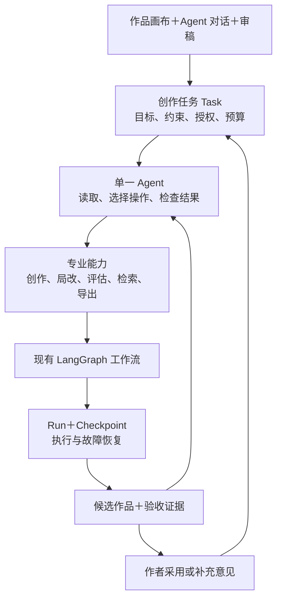

# Answer 1

> Question: 从 drama agent 想做的事情出发，分析一下整体的方案设计、架构设计等等可以怎么优化，使其成为一个更 agent-native、更用户友好的 agent 工作台。允许对整体的架构进行重构。

我的建议是：**保留现有技术栈，重构“创作任务—作品版本—作者决策”的关系，把 DramaAgent 做成以作品为中心的持续共创工作台。**

现有的版本、工作流、评估、检索和恢复机制值得保留。更大的提升空间在于：Agent 能否围绕同一个创作目标持续工作，作者能否直接看稿、改稿、判断和采用。

完整分析已保存到 [方案评审文档](/Users/kennywu/Documents/3-VibeProject/product/drama_agent/docs/AGENT_NATIVE_WORKBENCH_REVIEW.md)，包含代码证据、架构边界、迁移路线和验收条件。

**首先，产品目标应该围绕“完成作者认可的作品”。**

对个人创作者而言，核心循环是：

> 看见作品 → 发现问题 → 表达意见 → 获得修改 → 判断并采用 → 继续创作。

当前系统已经支持对话、分阶段确认和分批续写，但这个循环仍有几处断点：

| 当前情况 | 影响 |
|---|---|
| 聊天在工作台，正文、评估、版本在独立页面 | 看完问题后需要返回聊天，重新说明对象 |
| 修改请求缺少活动上下文时，即使明确指定剧集也可能被追问 | 用户需要适应系统操作规则 |
| 默认读取最新 `valid` 版本 | 结构合法的新稿与作者认可的稿件没有分开 |
| Outcome 主要接收运行状态、产物数量和评分变化 | 缺少足够正文证据判断创作要求是否满足 |
| 连续性领域模型较完整，写作链路实际更新较粗略 | 人物、伏笔、已知信息未充分支持持续续写 |

尤其需要优先解决后两项：扩大自主执行前，先让 Agent 正确理解作品、判断修改结果。[Outcome 实现](/Users/kennywu/Documents/3-VibeProject/product/drama_agent/backend/app/application/agent_outcome_service.py:252)、[剧情状态更新](/Users/kennywu/Documents/3-VibeProject/product/drama_agent/backend/app/workflows/nodes/write_episode.py:201)

**工作台应让正文占据中心，Agent 始终在旁边。**

推荐三个区域：

- **左侧作品导航**：设定、大纲、剧集与场景、参考资料、待审稿件。
- **中央作品画布**：阅读、选区、直接编辑、候选稿比较和采用。
- **右侧 Agent**：当前目标、对话、执行进度，以及需要作者决定的下一件事。

直接复用现有正文、评估和 Diff 组件。第一版无需建设完整富文本编辑器，先支持场景和台词编辑。

用户选中第三场，说“冲突提前，但保留最后一句”，系统应自动携带稿件版本、场景和选区。明确说“修改第 3 集剧本”时，也应直接定位目标。只有确实存在多个合理解释时才追问。

首次创作默认走“方向与设定 → 大纲 → 一集样稿 → 小批续写”。已有原稿可以直接进入修改；明确要求先试写一场，也应允许探索稿，避免把推荐流程变成强制向导。

**自主性应围绕一次创作目标授权。**

例如作者说：

> 把第三集改得更紧张，女主主动推动冲突，但不要提前揭露身份。

这已经足以授权 Agent 在第三集内读取相关事实、生成候选稿、检查约束，并针对明确问题做有限纠错。内部的每次评估和修改无需重新确认。

暂停点应放在有实际取舍的位置：需要改锁定设定、扩大到其他剧集、超过预算，或遇到必须由作者判断的审美问题。

默认完成一次修订与必要检查；发现明确可修复问题时允许一次纠错。不能仅为了提高评分持续循环。

**版本设计是这套自主性的前提。**

建议明确区分：

- **候选稿**：Agent 或作者正在探索的版本。
- **采用稿**：作者选定、供后续创作和默认导出的版本。
- **执行输入快照**：这次修改实际依据的设定、大纲和正文版本。

现有 Artifact 保持不可变，只增加采用版本指针。生成 v3 后，未采用之前，项目仍以 v2 为基线。[现有版本查询](/Users/kennywu/Documents/3-VibeProject/product/drama_agent/backend/app/db/repositories/artifacts.py:35)

这也不意味着每集都要确认：授权续写三集时，后集可以参考本批前集候选稿，最后审核一个候选包。部分采用时检查依赖，避免把未采用的剧情悄悄带入后续作品。

局部修改则增加稳定 `scene_id`，编号只负责显示。服务端将指定场景的修改合并为完整新版本，并验证其他场景未被改变。人工编辑和 Agent 修改共用这条保存路径。

**后端推荐保持单一编排器，并升级现有 Action 的职责。**

具体边界是：

- **Turn** 保留请求幂等和输入记录。
- **现有 AgentAction 演进为 Task**，保存持续目标、约束和待决策事项，避免再叠加一套 Action 状态机。
- **一个 Task 对应多个 Run**。故障恢复复用原 Run；作者决策后的下一段创作创建新 Run，通过明确作品引用衔接。
- 任务预算、取消请求和补充意见持久化；等待作者的任务不占执行槽。

当前 `generate_structured` 接口已经可以支持“选择下一操作 → 服务端校验执行 → 回填结果”的循环，无需先引入新 Agent SDK。

继续保留 Next.js、FastAPI、PostgreSQL、pgvector、LangGraph 和已有 Redis。暂不增加微服务、独立向量库、角色群聊或通用工作流搭建器。LangGraph 的 checkpoint 能继续承担执行恢复，但业务上的审稿、采用和目标完成需要清晰的数据语义。[官方持久化文档](https://docs.langchain.com/oss/python/langgraph/persistence)

**剧情记忆和验收，需要比调度更早补齐。**

已有的人物、伏笔、时间线模型应接入真实写作链路，并绑定稿件版本。分批续写或重启后，不能只从 Story Bible 重建初态，再跳过已经写完的剧集。

还应区分“作者知道的未来剧情”和“角色此刻知道的信息”。用户锁定“男主第八集才知道真相”，应该成为可追溯的创作约束。

目标验收则逐条显示“满足、未满足、未验证”，引用实际版本和正文。模型评估失败时，可以说“候选稿已完成，部分要求待确认”，不能把运行完成当作创作目标达成。评分继续作为辅助，作者采用才是作品判断的重要依据。

我建议按以下顺序推进，每阶段都能独立改善使用体验：

| 顺序 | 交付重点 | 核心验收 |
|---|---|---|
| 1 | 正文与对话同屏、自动上下文、真实结果说明、固定版本导出 | 同页完成看稿到判断修改 |
| 2 | 候选/采用版本、场景局改、人工编辑 | 拒绝候选不影响基线，局改不误改其他内容 |
| 3 | 剧情状态接线、设定修订、版本依赖 | 分批和重启续写不丢人物与伏笔状态 |
| 4 | 持久创作任务、有界自主执行 | 跨轮不丢目标，恢复不重置预算，越范围会暂停 |

如果只投入一轮开发，优先第一阶段，紧接着做候选与采用版本。真正需要验证的是作者采纳率、无关改动率、目标实际解决率，以及完成一次改稿的时间和成本。

本轮仅新增分析文档，未修改应用代码。结论来自静态实现与已有记录核对，未运行应用、测试或真实模型评测。

# Answer 2

> Question: [$waza:think](/Users/kennywu/.codex/plugins/cache/waza/waza/3.36.0/skills/think/SKILL.md)  给出每一个阶段的实施方案。

已整理成 **26 张任务卡**，写入[完整实施方案](/Users/kennywu/Documents/3-VibeProject/product/drama_agent/docs/AGENT_NATIVE_IMPLEMENTATION_PLAN.md)。每张卡包含修改文件、接口与数据结构、依赖、测试、验收和回退方式。

| 阶段 | 实施重点 | 完成标志 | 估算 |
|---|---|---|---|
| [一：同屏共创](/Users/kennywu/Documents/3-VibeProject/product/drama_agent/docs/AGENT_NATIVE_IMPLEMENTATION_PLAN.md:97) | 整合正文、聊天、评估和 Diff；接通原文解释、导入、固定版本导出；修复分批续写 | 同页完成改稿；解释有依据；重试不多写；历史下载不变 | 10–15 人日 |
| [二：版本与局改](/Users/kennywu/Documents/3-VibeProject/product/drama_agent/docs/AGENT_NATIVE_IMPLEMENTATION_PLAN.md:314) | 分离候选与采用稿；增加稳定场景 ID；人工和 Agent 共用局部编辑入口 | 未采用稿不污染后续创作；范围外正文不变；并发采用不会覆盖 | 8–12 人日 |
| [三：剧情与设定](/Users/kennywu/Documents/3-VibeProject/product/drama_agent/docs/AGENT_NATIVE_IMPLEMENTATION_PLAN.md:562) | 保存绑定版本的摘要、人物知识和伏笔；支持设定修订与影响分析 | 分批、重启后连续性保持；摘要失败不丢正文；未来安排不混入人物已知 | 6–9 人日 |
| [四：持续任务](/Users/kennywu/Documents/3-VibeProject/product/drama_agent/docs/AGENT_NATIVE_IMPLEMENTATION_PLAN.md:819) | Action 演进为 Task；跨 Run 执行；持久化反馈、暂停、预算和恢复 | 同一目标跨轮延续；重启不清预算、不重复采用；作者可随时干预 | 10–14 人日 |

建议先完整交付阶段一，再用实际创作体验决定后续节奏；每阶段都能独立使用。细化后串行估算约 **34–50 人日**，替代上一轮粗估。

本轮仅完成方案及交叉审阅，未修改应用代码、运行测试或执行数据库迁移。
