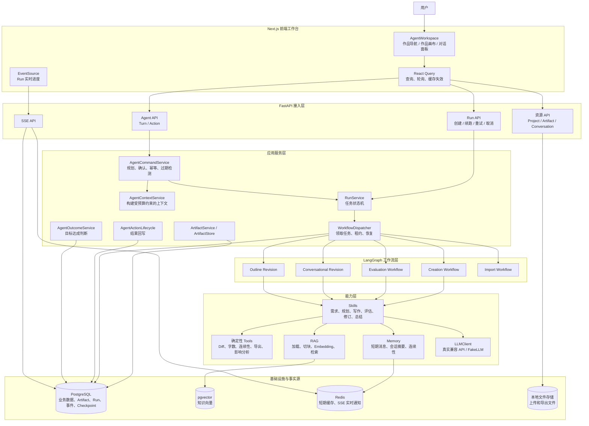
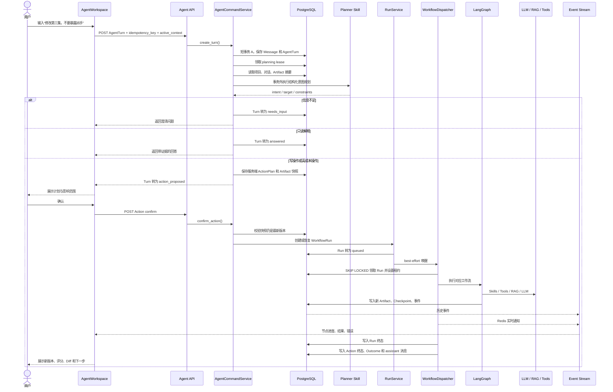
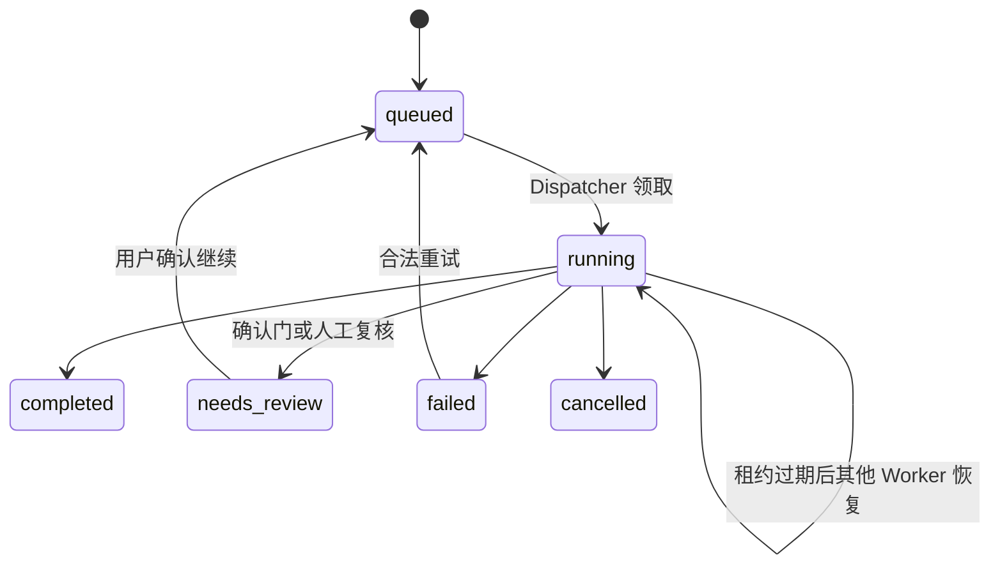
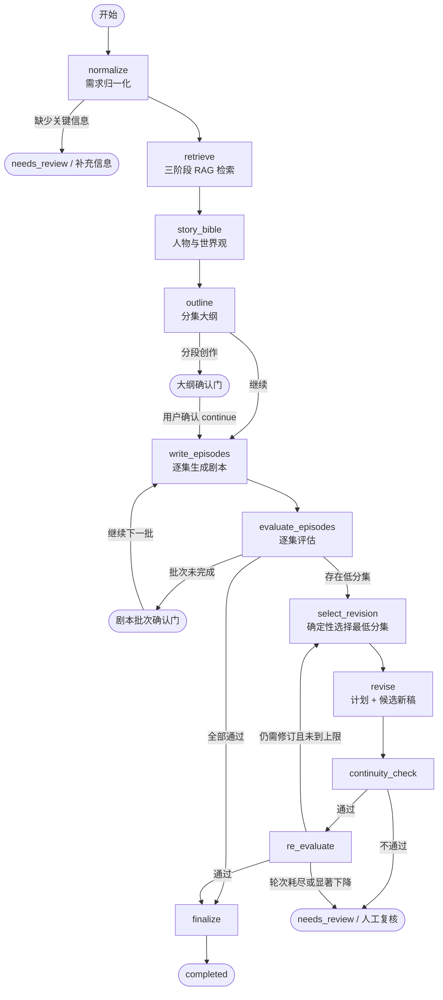
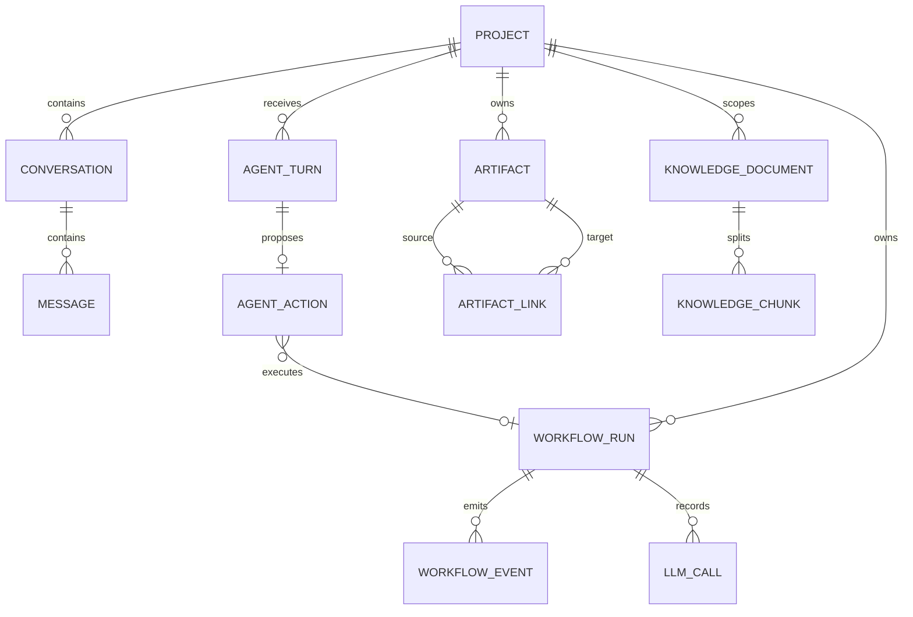

# DramaAgent 项目架构

> 本文基于 2026-09-22 的仓库代码整理。它描述当前实现，不把阶段性设计文档里的规划项当作已交付能力。

DramaAgent 是一个面向中文短剧创作的对话型 Agent 系统。整体结构可以概括为：对话控制面负责理解意图和请求确认，持久化执行面负责运行和恢复长任务，不可变资产面负责保存创作结果与版本历史。

它不是一次性 Prompt 应用，也不是 Multi-Agent 系统。模型负责理解和生成，服务端掌握权限、状态、版本、确认、恢复与审计。

## 整体架构



整个系统分成五个平面：

| 平面 | 核心对象 | 职责 |
|---|---|---|
| 交互控制面 | Conversation、Message、AgentTurn、AgentAction | 理解用户意图、澄清、展示计划、请求确认 |
| 执行面 | WorkflowRun、Dispatcher、LangGraph | 执行长任务、暂停、恢复、取消、失败重试 |
| 内容事实面 | Artifact、ArtifactLink | 保存 Story Bible、大纲、剧本、评估、修订和导出 |
| 上下文面 | Memory、RAG、ContextBuilder | 决定每次模型调用能看到什么 |
| 观察面 | WorkflowEvent、SSE、Metrics、Tracing | 展示进度、诊断成本和恢复状态 |

## 前端架构

前端使用 Next.js App Router、React、TypeScript、React Query 和原生 EventSource。主要入口是 [`AgentWorkspace.tsx`](../frontend/src/features/agent/AgentWorkspace.tsx)，桌面端分为三栏：

```text
┌──────────────┬──────────────────────────────┬──────────────────────┐
│ 作品导航      │ 作品画布                      │ Agent 对话            │
│              │                              │                      │
│ Story Bible  │ 剧本 / 大纲 / 评估 / Diff     │ 消息历史              │
│ 分集大纲      │ 版本选择                      │ Action Plan           │
│ 第 1..N 集    │ 导出 / 来源                   │ Run 进度              │
│ 版本与知识库  │                              │ 输入框 / 上传          │
└──────────────┴──────────────────────────────┴──────────────────────┘
```

URL 是阅读位置的事实源，记录当前会话、Artifact、版本、场景和面板。当前正在阅读的 Artifact 会自动成为对话的 `active_context`。新稿生成后，界面不会强行切换用户正在阅读的版本，只提示“打开本轮新稿”。

React Query 管理服务端状态，Run 结束后主动失效 Artifact、消息和项目等缓存。`useAgentConversation` 管理 Turn、幂等键和 Planner 轮询；`useAgentAction` 管理计划确认、拒绝及过期错误；`useRunEvents` 使用 SSE 展示节点进度。将 `NEXT_PUBLIC_AGENT_WORKSPACE_ENABLED` 设为 `false` 可以回滚到旧版输入区和进度面板。

相关入口：

- [`frontend/src/app/projects/[id]/page.tsx`](../frontend/src/app/projects/[id]/page.tsx)
- [`frontend/src/hooks/use-agent-conversation.ts`](../frontend/src/hooks/use-agent-conversation.ts)
- [`frontend/src/hooks/use-agent-action.ts`](../frontend/src/hooks/use-agent-action.ts)
- [`frontend/src/hooks/use-run-events.ts`](../frontend/src/hooks/use-run-events.ts)
- [`frontend/src/lib/api-client.ts`](../frontend/src/lib/api-client.ts)

## 对话式 Agent 控制链

这部分决定一条自然语言请求如何变成受约束、可确认、可恢复的执行任务。



`AgentTurn` 是一次用户请求的幂等收据，即使最后只是澄清或回答，也有持久化记录。`AgentAction` 保存需要确认的执行计划和审计状态。`WorkflowRun` 承载真正的长任务。`Artifact` 保存执行产生的业务成果。

当前支持的主要意图包括 `create_script`、`explain`、`evaluate`、`revise_script`、`revise_outline` 和 `continue`。`explain` 是只读操作，不创建 Run。其他操作会创建 Artifact 或产生高成本执行，需要先生成计划，用户确认后才能运行。`continue` 不创建新 Run，而是恢复停在确认门上的原 Run。

核心实现位于 [`backend/app/application/agent_command_service.py`](../backend/app/application/agent_command_service.py)。

## 服务端分层

### API 层

FastAPI 入口负责中间件、Request ID、CORS、异常映射、依赖注入、请求与响应 Schema、路由聚合及 `/metrics`。应用启动时还会检查 LangGraph checkpoint schema，并启动 Dispatcher。

主要 API 组包括：

- Projects
- Conversations / Messages
- Agent Turns / Actions
- Runs / SSE / Diagnostics
- Artifacts / Versions / Diff / References
- Evaluations
- Revisions
- Uploads / Imports
- Knowledge
- Exports

API 层不承载创作业务逻辑，而是调用 Application Service。入口见 [`backend/app/main.py`](../backend/app/main.py)。

### Application Service 层

这一层定义事务边界和业务编排：

| 服务 | 职责 |
|---|---|
| `AgentCommandService` | Turn、Planner、Action、确认和过期检测 |
| `AgentContextService` | 构建 Planner 与解释任务的受控上下文 |
| `RunService` | Run 创建、状态迁移、确认门续跑、重试和取消 |
| `WorkflowDispatcher` | 从数据库领取任务并执行 |
| `AgentActionLifecycle` | Run 结束后回写 Action 和消息 |
| `AgentOutcomeService` | 判断目标是否达成 |
| `ArtifactService` | Artifact 内容 Schema 校验 |
| `EvaluationService`、`RevisionService`、`ExportService` | 对应领域用例 |

Planner 的输出不能直接成为执行权限。它只提供意图、集数、约束等选择器，真正的 Artifact ID、工作流类型和执行参数由服务端解析。

## 任务调度与恢复

`WorkflowDispatcher` 是进程内 Worker，但执行事实源是 PostgreSQL，不是内存队列。



API 先持久化 `WorkflowRun`，再 best-effort 唤醒 Worker。Dispatcher 使用 `SELECT ... FOR UPDATE SKIP LOCKED` 原子领取任务，Run 带 `lease_owner` 和 `lease_expires_at`。Worker 崩溃后，另一个实例可以领取租约过期的 `running` Run。恢复超过最大次数后，Run 会以 `WORKFLOW_RECOVERY_EXHAUSTED` 失败。

数据库部分唯一索引保证一个项目最多存在一个 `queued` 或 `running` Run。取消采用协作式机制，工作流节点在安全点检查取消信号。`state_summary`、LangGraph checkpoint 和节点的 `completed_nodes` 共同避免重复调用模型或重复创建 Artifact。

核心实现位于 [`backend/app/application/workflow_dispatcher.py`](../backend/app/application/workflow_dispatcher.py)。

## LangGraph 工作流

### 创作主链路



主图定义于 [`backend/app/workflows/creation.py`](../backend/app/workflows/creation.py)。项目实际包含多张工作流图：

| Run action | 执行路径 |
|---|---|
| `create_script` | 完整创作图 |
| `evaluate` | 独立评估图 |
| `revise_script` | 锁定目标、补评估、修订、连续性检查、重评 |
| `revise_outline` | 大纲修订单节点图和影响分析 |
| `revise` | 独立自动修订图 |
| `import` | 文件解析和内容分类图 |
| `export` | 确定性 `ExportService`，不调用 LLM，也不经过 LangGraph |
| `platform_smoke` | 运维和测试快速路径 |

### 节点的统一结构

一个工作流节点通常按下面的顺序执行：

1. 检查自己是否已在 `completed_nodes` 中。
2. 发布 `node.started`。
3. 通过 Artifact ID 加载输入内容。
4. 调用 Skill、Tool、RAG 或 LLM。
5. 验证结构化结果。
6. 创建新 Artifact。
7. 更新轻量 State。
8. 保存 checkpoint。
9. 发布 `node.completed` 或错误事件。

LangGraph State 刻意只存 ID 和轻量状态，不存完整剧本，避免 checkpoint 持续膨胀。状态定义见 [`backend/app/workflows/state.py`](../backend/app/workflows/state.py)。

## Artifact 是业务事实源



Artifact 类型包括：

- `normalized_requirement`
- `story_bible`
- `episode_outline_set`
- `script_draft`
- `evaluation_report`
- `revision_plan`
- `continuity_check`
- `conversation_summary`
- `import_classification`
- `export_file`

Artifact 采用不可变版本模型：

```text
script_draft v1 ──evaluated_by──> evaluation_report v1
       │
       └──revised_into──> script_draft v2
                              │
                              └──evaluated_by──> evaluation_report v2
```

已有 Artifact 的 `content` 不原地更新。修订总是插入新版本，同时记录 `version`、`checksum`、`input_hash`、`prompt_version`、`source_artifact_ids` 和 `artifact_links`。

这套数据模型支持历史版本回看、新旧版本 Diff、评估绑定到确切剧本版本、Action 确认前的过期检测、重试幂等，以及结果来源追踪。实现见 [`backend/app/db/models/artifact.py`](../backend/app/db/models/artifact.py) 和 [`backend/app/artifacts/store.py`](../backend/app/artifacts/store.py)。

## LLM、Skill 与 Tool 的边界

### LLM 层

`LLMClient` 抽象出统一的结构化生成接口。`OpenAICompatibleLLM` 调用真实兼容 API，`FakeLLM` 为测试提供确定性实现。不同角色可以配置不同模型，包括 planner、writer、evaluator、reviser 和 summarizer。

Pydantic Schema 会注入提示词，返回内容再经过 Schema 校验。客户端统一处理超时、429、5xx、重试、Token 使用量和调用预算。

### Skill 层

Skill 是带领域语义的能力，包括需求归一化、命令规划、Story Bible 生成、大纲生成、剧本写作、评估、剧本修订、大纲修订、总结、内容解释和 Outcome 评估。Skill 可以调用 LLM，但必须返回明确的领域 Schema。

### Tool 层

Tool 承担确定性计算，包括字数统计、对话比例、剧本结构特征、Diff、连续性检查、大纲影响分析、Markdown 与 DOCX 导出，以及文件解析。能由代码判断的内容不交给模型判断。

## Memory 与 ContextBuilder

Memory 按用途拆成几层：

```text
最近消息       Redis ShortTermStore
    ↓ 丢失可恢复
完整消息       PostgreSQL Message

长对话摘要     conversation_summary Artifact
剧情连续性     ContinuityState / EpisodeSummary
作品事实       Story Bible / Outline / Script Artifact
知识参考       RAG KnowledgeChunk
    ↓
ContextBuilder 按任务策略和 Token 预算组装
    ↓
Planner / Writer / Evaluator / Reviser
```

`ContextBuilder` 将上下文分为系统规则、当前用户请求、Story Bible 与大纲、会话摘要与剧情连续性、RAG 参考材料，以及当前目标稿件。

当前目标稿件属于受保护内容，不能被静默截断。目标稿件超出预算时，系统直接报错，避免模型只看到半篇剧本就开始修订。

## RAG 架构

```text
knowledge/*.md
    ↓ Loader + Frontmatter 校验
KnowledgeDocument
    ↓ Chunker
KnowledgeChunk
    ↓ Embedder
pgvector
    ↓ Retriever
按创作阶段筛选、排序、去重
    ↓
Story Bible / Outline / Writer 上下文
```

不同创作阶段使用不同类别。Story Bible 阶段检索题材模板、人物原型和参考资料；Outline 阶段检索题材模板、开篇钩子和参考资料；Writer 阶段检索爽点、人物原型和参考资料。

RAG 是增强项。检索失败时可以退化为空上下文，不应阻断创作主链路。

## 事件流与前端进度

工作流事件先写入 PostgreSQL 的 `workflow_events`，Redis Pub/Sub 只负责低延迟通知。Redis 不可用时，SSE 会轮询 PostgreSQL。EventSource 重连后可以通过 `Last-Event-ID` 补发历史事件，页面刷新后也能从 Run 和事件表恢复进度。

PostgreSQL 是事件事实源，Redis 是加速器。实现见 [`backend/app/events/stream.py`](../backend/app/events/stream.py) 和 [`backend/app/events/publisher.py`](../backend/app/events/publisher.py)。

## 关键设计决策

### 聊天不保存作品事实

聊天负责表达意图，Story Bible、大纲、剧本和评估以 Artifact 为准。用户在聊天中说“第三集改好了”，不会直接覆盖第三集内容。

### 模型没有自由执行权限

Planner 不能输出任意 URL、SQL、工具名或可信 Artifact ID。服务端只接受白名单意图，并自行解析目标。

### 写操作必须确认

模型先规划，用户确认后执行。确认时还会校验来源 Artifact 的 ID、版本和 checksum。来源已经变化时，Action 会转为 `stale`。

### 数据库保存执行事实

API 唤醒失败不代表任务丢失。Dispatcher 启动时会扫描数据库中的 `queued` Run 和租约过期的 `running` Run。

### 版本优先于覆盖

Artifact 的不可变设计让审计、Diff、恢复、过期检测和结果证据使用同一套数据模型。

### 模型判断受确定性证据约束

评分、版本关系、连续性报告、Diff 和受影响剧集由代码和持久化数据提供。只有纯语义约束无法判断时，系统才调用 Outcome Evaluator。

## 优势与当前边界

这套架构的优势集中在可靠性和可审计性：长任务不依赖 Web 请求一直存活；规划、确认和执行分离；Artifact 保存完整版本与来源链；Turn、Action、Run 和 Artifact 都有幂等保护；Redis、RAG 和外部 MCP 可以降级；FakeLLM、Golden Fixture 和分层测试让复杂工作流能够确定性验证。

当前实现也有明确边界：

- Dispatcher 与 FastAPI 运行在同一进程。数据库租约支持多个实例领取任务，但大规模部署更适合拆成独立 Worker 服务。
- 上传和导出使用本地文件存储，多实例部署需要共享卷或对象存储实现。
- 单项目只能有一个活动 Run，简化了一致性，也会串行化同项目的导入、导出、评估和创作。
- SSE 始终带数据库轮询回退，连接数增加后需要关注数据库查询压力。
- `completed_nodes` 是扁平列表。代码已注明，自动修订轮次大于 1 时需要引入带轮次的节点键。
- LLM 结构化输出主要依靠 Schema 注入和解析重试，不是原生受约束解码，解析与截断处理相对复杂。
- [`DESIGN.md`](../DESIGN.md) 是 Phase J 的阶段性设计，里面部分“本次不建设”的描述不能代表仓库当前能力。仓库现在已经包含 RAG、Memory 和默认关闭的 MCP 适配骨架。

## 架构总结

DramaAgent 用 AgentTurn 管理对话幂等，用 AgentAction 管理执行权限，用 WorkflowRun 管理长任务，用 Artifact 保存内容事实，用 WorkflowEvent 提供可观察性。LangGraph、Skill、RAG 和 LLM 都运行在这些确定性边界内。

更深入的实现讲解见 [`docs/ARCHITECTURE_WALKTHROUGH.md`](ARCHITECTURE_WALKTHROUGH.md)，对话式 Agent 的设计背景和契约见 [`DESIGN.md`](../DESIGN.md)。
